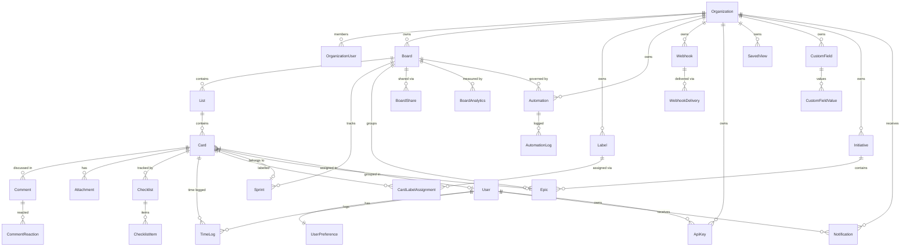

<div align="center">

#  NEXUS

### Enterprise-Grade SaaS Project Management Platform

[](https://nextjs.org/)
[](https://react.dev/)
[](https://www.typescriptlang.org/)
[](https://www.prisma.io/)
[](https://stripe.com/)
[](https://supabase.com/)
[](https://openai.com/)
[](https://jestjs.io/)
[](https://github.com/viraj1011JAIN/Nexus/actions)
[](https://coderabbit.ai)
[](LICENSE)

**A full-featured, production-ready SaaS project management tool built entirely solo — Kanban boards, real-time collaboration, AI-powered card assistance, sprints, epics, roadmapping, automation engine, outbound webhooks, public REST API, analytics, file attachments, GitHub/Slack integrations, Stripe billing, and more.**

[Quick Start](#quick-start)  [Tech Stack](#tech-stack)  [Architecture](#architecture)  [API Reference](#api-reference)  [Testing](#testing)  [Code Review](#code-review-with-coderabbit)

</div>

---

## Table of Contents

- [Overview](#overview)
- [What Makes This Different](#what-makes-this-different)
- [Complete Feature Set](#complete-feature-set)
- [Tech Stack](#tech-stack)
- [Architecture](#architecture)
- [Database Schema](#database-schema)
- [Project Structure](#project-structure)
- [API Reference](#api-reference)
- [Core Engine Deep Dives](#core-engine-deep-dives)
- [Integrations](#integrations)
- [Quick Start](#quick-start)
- [Environment Variables](#environment-variables)
- [Available Scripts](#available-scripts)
- [Testing](#testing)
- [CI/CD Pipeline](#cicd-pipeline)
- [Code Review with CodeRabbit](#code-review-with-coderabbit)
- [Deployment](#deployment)
- [Security Model](#security-model)
- [Performance Optimizations](#performance-optimizations)
- [Contributing](#contributing)
- [License](#license)

---

## Overview

Nexus is a multi-tenant SaaS project management platform built on the **Next.js 16 App Router**. It targets the quality bar of tools like Jira, Linear, and Trello — combining Kanban boards, sprint management, roadmapping, epics, AI-powered card assistance, a no-code automation engine, outbound webhooks, a public REST API, real-time presence and board sync, Supabase Storage file attachments, a Recharts analytics dashboard with PDF export, Stripe subscription billing, and a full notification system — all built and shipped production-ready.

**Scale of the codebase:**
- **37 tracked feature tasks**, 32+ fully implemented
- **953-line Prisma schema** with 30+ models
- **35 server action files** covering every domain
- **20 API route directories** including REST v1, webhooks, integrations
- **122 unit tests** + **19 integration tests** + Playwright E2E suite
- Latest commit: **42+ files changed**, 4,286 insertions

---

## What Makes This Different

| Concern | Approach |
|---|---|
| **Card ordering** | LexoRank strings — no integer rebalancing, survives unlimited reorders |
| **Real-time sync** | Supabase `postgres_changes` — whole board repatches on every remote mutation |
| **Presence + locking** | Supabase Presence per board; card-level optimistic lock shown to peers |
| **Auth + tenancy** | Clerk v6 `getTenantContext()` — orgId always from signed JWT, auto-provisions rows, deduplicated per request via React `cache()` |
| **AI assistance** | OpenAI gpt-4o-mini: priority suggestion on create, description generation, checklist suggestions — 50 calls/org/day rate-limited with DB-backed counter |
| **Automation engine** | Event-driven, fire-and-forget, depth-guarded (MAX 3) to prevent infinite loops |
| **Webhook security** | HMAC-SHA256 signatures (`X-Nexus-Signature-256`) + full SSRF protection with CIDR blocklist |
| **REST API** | Scoped API keys (SHA-256 hashed, prefix stored); `boards:read/write`, `cards:read/write` |
| **Billing** | Stripe Checkout + Customer Portal + webhook lifecycle; FREE plan board limit enforced server-side |
| **Race conditions** | `db.$transaction` in template creation; serializable transaction on upload; `latestResolve` pattern in @mention suggestion |
| **GitHub integration** | Verifies `X-Hub-Signature-256`; auto-moves cards to Done on PR merge by card ID in commit messages |

---

## Complete Feature Set

### Authentication & Multi-Tenancy

- Clerk v6 sign-in, sign-up, org creation and switching
- `getTenantContext()` — extracts `userId`, `orgId`, `orgRole` and membership in one deduplicated call per request (React `cache()`); auto-provisions missing `User` and `OrganizationUser` rows on first access
- `requireRole()` — minimum-role enforcement (OWNER > ADMIN > MEMBER > GUEST) on every mutating server action
- Demo-mode guard (`isDemoOrganization`, `protectDemoMode`) — read-only sandbox that silently blocks writes
- Per-user in-memory sliding-window rate limiting on board creation
- Middleware protecting all `/dashboard`, `/board`, `/settings`, `/billing`, `/activity` routes

### Board Management

- Create, rename and delete boards — org-scoped, role-checked; FREE plan limit versus live Stripe subscription
- **Unsplash background picker** — 500 ms debounced search, 6 quick-tag pills, 3-column photo grid, load-more pagination, attribution footer; `imageFullUrl` renders as full-page background with dark overlay
- **Board templates** — 6 built-in: Kanban Board, Sprint Planning, Marketing Campaign, Product Roadmap, Design System, Hiring Pipeline; all creation wrapped in `db.$transaction`
- Template picker UI — category filter tabs, colour-coded badges, list/card counts
- Soft-delete support on `Organization` model

### List & Card Management

- Create, rename and delete lists and cards; drag-and-drop within and across lists via `@dnd-kit/core`
- LexoRank ordering persisted via `updateListOrder` and `updateCardOrder`
- **Card modal** with full detail view:
  - Rich-text description — TipTap v3 (StarterKit, Underline, Link, TaskList, TaskItem, Placeholder, CharacterCount 10 000 chars, TextAlign, Highlight, CodeBlockLowlight)
  - Auto-save (500 ms debounce) with `Idle / Saving / Saved / Error` visual states
  - Priority selector — LOW / MEDIUM / HIGH / URGENT
  - Smart due date — countdown, green/amber/red colour states, quick presets, shake animation on overdue
  - Assignee picker — org member list with avatars, optimistic UI with rollback
  - Label manager — org-scoped labels, colour picker, optimistic UI
  - Threaded comments — TipTap editor, `parentId` nesting, emoji reactions (unique per user/emoji/comment)
  - Emoji picker and GIF picker (Giphy API / Klipy fallback)
  - Per-card activity log tab
  - Read-only mode when card is locked by a peer

### AI-Powered Card Assistance (TASK-022)

Three entry points powered by OpenAI `gpt-4o-mini`:

**Entry Point 1 — Priority Suggestion (card create form):**
Fires when the user stops typing in the card title (debounced). Returns `{ priority: "HIGH", confidence: 0.87 }`. Displayed as a coloured suggestion chip; clicking it pre-fills the priority on the new card.

**Entry Point 2 — Description Generation (card modal Description tab):**
" Generate description" button triggers `generateCardDescription(cardTitle)`. Result inserted into TipTap editor via `editor.commands.setContent()`.

**Entry Point 3 — Checklist Suggestions (card modal Checklists tab):**
" AI Suggest Items" button calls `suggestChecklists(cardTitle)`. Returns 3–7 actionable items previewed as checkboxes; user accepts individually or all at once.

**Rate limiting:** 50 AI calls per org per day. `Organization.aiCallsToday` incremented atomically; `aiCallsResetAt` triggers midnight reset. Over-limit requests return a user-friendly error without crashing the UI.

### Checklists (TASK-009)

- Multiple checklists per card, each with `title` and LexoRank `order`
- Items: `isComplete`, `order`, optional `assigneeId` and `dueDate`, `completedAt` timestamp
- Progress bar showing completion percentage; AI suggestion integration

### Sprints (TASK-013)

- Board-scoped sprints: `PLANNING / ACTIVE / COMPLETED` status enum
- Fields: `name`, `goal` (text), `startDate`, `endDate`, `completedAt`
- Cards linked via `sprintId` FK + `storyPoints` field
- `sprint-actions.ts` — create, start, complete, archive

### Card Dependencies (TASK-014)

- Three types: `BLOCKS`, `RELATES_TO`, `DUPLICATES`
- Bidirectional `blocker` / `blocked` FKs on `Card`; unique constraint `(blockerId, blockedId)`
- `dependency-actions.ts` — add/remove/list dependencies

### Custom Fields (TASK-018)

- Nine field types: `TEXT`, `NUMBER`, `DATE`, `CHECKBOX`, `SELECT`, `MULTI_SELECT`, `URL`, `EMAIL`, `PHONE`
- Scoped to org or specific board; `isRequired` and `order` per field
- Values in `CustomFieldValue` with typed columns: `valueText`, `valueNumber`, `valueDate`, `valueBoolean`, `valueOptions` (String[])

### Automation Engine (TASK-019)

See [deep dive](#automation-engine) below.

**10 trigger types:** `CARD_CREATED`, `CARD_MOVED`, `CARD_DELETED`, `CARD_DUE_SOON`, `CARD_OVERDUE`, `LABEL_ADDED`, `CHECKLIST_COMPLETED`, `MEMBER_ASSIGNED`, `PRIORITY_CHANGED`, `CARD_TITLE_CONTAINS`

**9 action types:** `MOVE_CARD`, `SET_PRIORITY`, `ASSIGN_MEMBER`, `ADD_LABEL`, `REMOVE_LABEL`, `SET_DUE_DATE_OFFSET`, `POST_COMMENT`, `SEND_NOTIFICATION`, `COMPLETE_CHECKLIST`

Safety: `MAX_AUTOMATION_DEPTH = 3`. Every execution logged to `AutomationLog`.

### Outbound Webhooks (TASK-020)

- Org-scoped, configurable URL + event filter + HMAC secret
- `X-Nexus-Signature-256` (HMAC-SHA256, same pattern as GitHub)
- Full SSRF protection: DNS resolution validated against private CIDR blocklist
- Every attempt logged in `WebhookDelivery` with `statusCode`, `success`, `duration`

### Public REST API (TASK-021)

Scoped API key auth. Keys SHA-256 hashed; only prefix stored plaintext. Full endpoint reference in [API Reference](#rest-api-v1).

### Time Tracking (TASK-025)

- `TimeLog`: `cardId`, `userId`, `orgId`, `minutes`, `description`, `loggedAt`
- Log, edit, delete time entries per card; total time displayed on card modal

### Roadmap — Initiatives & Epics (TASK-023)

- **Initiative** — top-level strategic objective with timeline, color, status
- **Epic** — mid-level grouping under initiative, scoped to board, contains `Card[]`
- Cards linked via `epicId` FK; roadmap view at `/roadmap`

### Board Sharing & Guest Access (TASK-030)

- `BoardShare`: unique `token`, `allowComments`, `passwordHash`, `expiresAt`, `viewCount`
- Public board view at `/shared/[token]` — no auth required

### Saved Views / Filters (TASK-012)

- `SavedView`: `filters` (JSON), `viewType` (kanban/list), `isShared`, org or board scoped

### In-App Notifications (TASK-006/032)

Eight types: `MENTIONED`, `ASSIGNED`, `CARD_DUE_SOON`, `CARD_OVERDUE`, `COMMENT_ON_ASSIGNED_CARD`, `BOARD_SHARED`, `SPRINT_STARTED`, `DEPENDENCY_RESOLVED`

- Notification bell with unread badge
- Web Push notifications via `web-push` v3.6.7; `User.pushSubscription` persisted

### Real-Time Collaboration

- `useRealtimeBoard` — Supabase `postgres_changes` per board; auto-reconnects; remote-change toast
- `usePresence` — stacked avatar strip with 8-colour palette, "joined X ago" tooltip, multi-tab dedup
- `useCardLock` — Presence-based lock; all inputs disabled when another user is editing
- `useRealtimeAnalytics` — Supabase broadcast refreshes analytics charts on card events

### @Mention System

- TipTap `extension-mention`; keyboard-navigable dropdown with member avatars
- `createMentionSuggestion()` factory — `latestResolve` closure prevents leaked Promises
- Backed by `/api/members`; triggers `sendMentionEmail()` fire-and-forget on comment save

### File Attachments

- Supabase Storage `card-attachments` bucket; 10 MB limit; SVG excluded from MIME allowlist
- Org ownership verified before write; uploader-only delete
- `npm run setup:storage` — idempotent bucket provisioner

### GitHub Integration (TASK-027)

- Verifies `X-Hub-Signature-256`; extracts card IDs from commit messages
- **PR merged**  moves referenced cards to Done list automatically
- `push` + `pull_request` events  `AuditLog` entries

### Slack Integration (TASK-027)

- Slash command handler at `/api/integrations/slack`
- Create cards, query board status, receive summaries in Slack

### Analytics Dashboard

- Velocity chart (14-day), priority pie chart, top contributors bar chart, overview metrics
- All charts loaded client-side via `next/dynamic` with `ssr: false`
- PDF export — jsPDF v4 + jspdf-autotable; timestamped filename

### Email Notifications

- Resend v6.9.2; XSS-safe HTML templates
- Vercel Cron daily reminders + Monday digest

### Audit Logs & Activity

- `AuditLog` on every BOARD/LIST/CARD CREATE/UPDATE/DELETE — IP, user agent stored
- Org activity feed at `/activity`; per-card activity tab

### Billing & Subscriptions

- Stripe Checkout + Customer Portal; FREE (board limit) and PRO (unlimited)
- Webhook handles full subscription lifecycle

### Bulk Card Operations (TASK-026)

- Move, assign, set priority, add label, delete — multiple cards in one action

### Import / Export (TASK-029)

- JSON/CSV board export; Trello/Asana JSON import

### GDPR / Data Deletion (TASK-033)

- Deletion request queue at `/api/gdpr/delete-request/`
- Cookie consent on `UserPreference.cookieConsent`

### Command Palette

- `Ctrl+K` / `Cmd+K` — searches boards and cards (50 results each), Quick Actions, Recent Items

### Progressive Web App

- `manifest.json` with App Shortcuts; `icon-192.png`, `icon-512.png`, `apple-touch-icon.png`

### Performance Utilities

- `LazyLoad` (Intersection Observer), `VirtualScroll` (windowed), `PerformanceWrapper`
- Turbopack in dev; charts/PDF code-split; `optimizePackageImports`, `serverExternalPackages`

---

## Tech Stack

| Category | Package | Version |
|---|---|---|
| Framework | `next` | 16.1.4 |
| UI library | `react` / `react-dom` | 19.2.3 |
| Language | `typescript` | ^5 |
| ORM | `prisma` / `@prisma/client` | 5.22.0 |
| Auth | `@clerk/nextjs` | 6.36.10 |
| Realtime + Storage | `@supabase/supabase-js` | 2.91.1 |
| AI | `openai` | ^4.104.0 |
| Payments (server) | `stripe` | 20.2.0 |
| Payments (client) | `@stripe/stripe-js` | 8.6.4 |
| Error tracking | `@sentry/nextjs` | 10.36.0 |
| Rich text | `@tiptap/react` | 3.17.1 |
| Drag and drop | `@dnd-kit/core` / `@dnd-kit/sortable` | 6.3.1 / 10.0.0 |
| Validation | `zod` | 4.3.6 |
| UI state | `zustand` | 5.0.10 |
| Animation | `framer-motion` | 12.29.0 |
| Charts | `recharts` | 3.7.0 |
| PDF export | `jspdf` + `jspdf-autotable` | 4.1.0 / 5.0.7 |
| Dates | `date-fns` | 4.1.0 |
| Email | `resend` | 6.9.2 |
| Push notifications | `web-push` | ^3.6.7 |
| Toasts | `sonner` | 2.0.7 |
| Tooltips | `tippy.js` / `@tippyjs/react` | 6.3.7 |
| Icons | `lucide-react` | 0.563.0 |
| UI primitives | Radix UI (via shadcn/ui) | various |
| Styling | `tailwindcss` | ^4 |
| Theming | `next-themes` | 0.4.6 |
| Unsplash | `unsplash-js` | 7.0.20 |
| Emoji picker | `emoji-picker-react` | 4.17.3 |
| Unit testing | `jest` | 30.2.0 |
| E2E testing | `@playwright/test` | 1.58.2 |
| Test utilities | `@testing-library/react` | 16.3.2 |
| Dev server | Turbopack | (built into Next.js 16) |

---

## Architecture

### System Overview

```

                       CLIENT LAYER                           
           Browser (desktop + mobile)  PWA install           

                          HTTPS

                  VERCEL EDGE NETWORK                         
           Global CDN  Next.js Middleware auth guard         

                         

               NEXT.JS 16 APP ROUTER                          
                                                              
       
   Server Components          Server Actions              
    (zero client JS)     (Zod-validated mutations,        
       getTenantContext on every)       
       
  Client Components       
   (optimistic UI,             API Routes                  
    realtime hooks)      (webhooks, upload, search,        
       cron, REST v1, integrations)     
                           

                                             
    
Supabase Clerk   Stripe   Resend  OpenAI  
Postgres Auth/  Billing   Email   gpt-4o- 
Realtime Orgs   Webhooks Delivery mini    
Storage                                   
    
```

### Mutating Request Lifecycle

Every server action and mutating API route follows this exact path:

```
1. getTenantContext()    Validates Clerk session (React cache()  runs once per request)
                        Auto-provisions User + OrganizationUser rows if absent
                        orgId ALWAYS from JWT — never from params or client input

2. requireRole()        Asserts minimum role for the operation
                        Throws TenantError("FORBIDDEN") if insufficient

3. Zod schema.parse()   Rejects malformed input before any DB access

4. DAL query            orgId injected on every query
                        IDOR checks on ownership-sensitive access

5. createAuditLog()     Records action, entityType, entityTitle, IP, userAgent

6. revalidatePath()     Invalidates Next.js cache for affected pages

7. return { data }      Client applies optimistic update; rolls back on error
```

### Real-Time Data Flow

```
Supabase postgres_changes
   useRealtimeBoard
         Patches local React state (INSERT / UPDATE / DELETE)
         Shows toast for remote changes (not own changes)
         Auto-reconnects on channel failure

Supabase Presence
   usePresence  stacked avatar strip (8-colour palette)
   useCardLock  lock acquired on modal open, released on close
                   all inputs disabled when locked by peer

Supabase Broadcast
   useRealtimeAnalytics  refreshes charts on card events
```

### Multi-Tenancy Security Model

```
Clerk JWT
    
    
getTenantContext()             React cache() — runs ONCE per request
    
     userId + orgId extracted from signed JWT
     User row healed on first access (handles webhook delays + race conditions)
     OrganizationUser.isActive verified
     Returns { userId, orgId, orgRole, membership }
              
              
    requireRole(ctx, "MEMBER")
              
              
    DAL query: WHERE orgId = ctx.orgId AND ...
              
               No cross-org data leakage possible
```

---

## Database Schema

### Entity Relationship Diagram



### Model Reference

| Model | Purpose | Key Fields |
|---|---|---|
| `Organization` | Top-level tenant | `slug`, `region`, `deletedAt`, 6 Stripe fields, `aiCallsToday`, `aiCallsResetAt` |
| `User` | Auth identity | `clerkUserId`, `email`, `name`, `imageUrl`, `pushSubscription` |
| `OrganizationUser` | Role per tenant | `role` (OWNER/ADMIN/MEMBER/GUEST), `isActive`, `invitedById`, `joinedAt` |
| `Board` | Kanban board | `title`, `orgId`, 5 Unsplash image fields |
| `List` | Column | `title`, `order` (LexoRank), `boardId` |
| `Card` | Work item | `title`, `description`, `dueDate`, `priority`, `assigneeId`, `order` (LexoRank), `coverColor`, `coverImage`, `storyPoints`, `estimatedMinutes`, `epicId`, `sprintId` |
| `Label` | Org-scoped tag | `name`, `color`, unique `(orgId, name)` |
| `CardLabelAssignment` | M:N join | unique `(cardId, labelId)` |
| `Comment` | Threaded comment | `text` (HTML), `parentId`, `mentions` (String[]), `isDraft` |
| `CommentReaction` | Emoji per comment | unique `(commentId, userId, emoji)` |
| `Attachment` | File on card | `fileName`, `fileSize`, `mimeType`, `url`, `storagePath` |
| `Checklist` | Task list | `title`, `order`, `items[]` |
| `ChecklistItem` | Task item | `isComplete`, `order`, `assigneeId`, `dueDate`, `completedAt` |
| `Sprint` | Agile sprint | `name`, `goal`, `status` (PLANNING/ACTIVE/COMPLETED), `startDate`, `endDate` |
| `Epic` | Card grouping | `title`, `status`, `initiativeId`, `boardId`, `dueDate` |
| `Initiative` | Strategic goal | `title`, `status`, `startDate`, `endDate`, `color`, `epics[]` |
| `CardDependency` | Blocking relation | `type` (BLOCKS/RELATES_TO/DUPLICATES), unique `(blockerId, blockedId)` |
| `CustomField` | Dynamic field | `name`, `type` (9 variants), `options` (JSON), `isRequired` |
| `CustomFieldValue` | Value per card | `valueText/Number/Date/Boolean/Options`, unique `(fieldId, cardId)` |
| `Automation` | No-code rule | `trigger` (JSON), `conditions` (JSON), `actions` (JSON), `runCount`, `lastRunAt` |
| `AutomationLog` | Execution record | `automationId`, `cardId`, `success`, `error` |
| `Webhook` | Outbound hook | `url`, `secret`, `events` (String[]), `isEnabled` |
| `WebhookDelivery` | Delivery attempt | `event`, `payload`, `statusCode`, `success`, `duration` |
| `ApiKey` | REST API key | `keyHash` (SHA-256), `keyPrefix`, `scopes`, `expiresAt`, `revokedAt` |
| `TimeLog` | Time entry | `cardId`, `userId`, `minutes`, `description`, `loggedAt` |
| `Notification` | In-app alert | 8-variant `NotificationType`, `entityId/Type/Title`, `isRead` |
| `SavedView` | Filter preset | `filters` (JSON), `viewType`, `isShared` |
| `BoardShare` | Public link | `token` (unique), `allowComments`, `passwordHash`, `expiresAt`, `viewCount` |
| `BoardAnalytics` | Board metrics | `totalCards`, `completedCards`, `weeklyTrends` (JSON), `priorityDistribution` (JSON) |
| `UserAnalytics` | Per-user daily | `cardsCreated`, `cardsCompleted`, `commentsAdded`, `activeMinutes` per date |
| `ActivitySnapshot` | Org timeline | aggregate counters per `timestamp` |
| `UserPreference` | User settings | 9 boolean flags, `onboardingStep`, `cookieConsent` |
| `BoardTemplate` | Reusable board | `title`, `category`, `orgId` (null = global), `lists[]` |
| `AuditLog` | Security trail | `orgId`, `action`, `entityType/Id/Title`, `userId`, `ipAddress`, `userAgent` |

---

## Project Structure

```
nexus/
 app/
    layout.tsx                  # Root layout — theme, auth, toasts, PWA
    page.tsx                    # Landing page with animated hero
    globals.css / editor.css    # Tailwind base + TipTap overrides
    dashboard/                  # Board list (server component)
    board/[boardId]/            # Kanban + analytics tabs
    activity/                   # Org audit log feed
    billing/                    # Stripe billing page
    onboarding/                 # Guided onboarding flow
    roadmap/                    # Initiatives + Epics view
    settings/                   # User preferences
    shared/[token]/             # Public board view (no auth)
    api/
        v1/boards/ v1/cards/    # REST API (API key auth)
        upload/                 # Supabase Storage upload + DELETE
        members/                # Org member search (@mention)
        stripe/checkout/portal/ # Stripe Checkout + Portal
        webhook/stripe/         # Stripe webhook handler
        integrations/github/    # GitHub webhook handler
        integrations/slack/     # Slack slash command handler
        cron/daily-reports/     # Vercel Cron: reminders + digest
        push/                   # Web Push subscribe/unsubscribe
        export/ import/         # Board export/import
        gdpr/delete-request/    # GDPR deletion queue
        health/                 # Health check

 actions/                        # 35 Server Action files
    ai-actions.ts               # suggestPriority, generateCardDescription, suggestChecklists
    automation-actions.ts       # Automation CRUD + TriggerType/ActionType enums
    webhook-actions.ts          # Webhook CRUD + test
    sprint-actions.ts           # Sprint lifecycle
    roadmap-actions.ts          # Initiatives + Epics CRUD
    time-tracking-actions.ts    # Time log CRUD
    custom-field-actions.ts     # Custom field + value CRUD
    dependency-actions.ts       # Card dependency management
    bulk-card-actions.ts        # Bulk operations
    phase3-actions.ts           # Priority, due dates, comments + @mention
    ...                         # (30 more files — see Project Structure above)

 components/
    modals/card-modal/          # Full card detail modal + all tabs
    board/                      # List container, card item, unsplash picker
    analytics/                  # Recharts wrappers
    editor/                     # @mention autocomplete
    layout/                     # Navbar, sidebar, org switcher
    ui/                         # shadcn/ui primitives

 hooks/
    use-realtime-board.ts       # Supabase postgres_changes
    use-presence.ts             # Supabase Presence
    use-card-lock.ts            # Presence-based card locking
    use-realtime-analytics.ts   # Analytics broadcast

 lib/
    tenant-context.ts           # getTenantContext(), requireRole() (252 lines)
    automation-engine.ts        # Automation event bus (495 lines)
    webhook-delivery.ts         # Outbound webhooks + SSRF protection (415 lines)
    lexorank.ts                 # LexoRank ordering
    email.ts                    # Resend email send functions
    dal.ts                      # Data Access Layer

 prisma/
    schema.prisma               # 953 lines, 30+ models
    seed.ts                     # 6 built-in templates seeder

 __tests__/
    unit/                       # 7 suites, 122 tests
    integration/                # 1 suite, 19 tests

 e2e/                            # Playwright specs
     auth.setup.ts
     boards.spec.ts
     cards.spec.ts
```

---

## API Reference

### REST API v1

Base URL: `https://yourdomain.com/api/v1`

**Authentication:** `Authorization: Bearer <api_key>`

All keys are managed from `/settings`  API Keys. Keys are SHA-256 hashed in the database — only the prefix (`nx_live_...`) is displayed after creation.

**Scopes:** `boards:read`, `boards:write`, `cards:read`, `cards:write`

#### `GET /api/v1/boards`

Returns all boards for the authenticated org.

```json
{
  "data": [
    { "id": "uuid", "title": "My Board", "orgId": "org_...", "imageThumbUrl": "...", "createdAt": "..." }
  ],
  "meta": { "total": 5 }
}
```

#### `POST /api/v1/boards` _(requires `boards:write`)_

```json
// Request body
{ "title": "Engineering", "imageId": "unsplash-id" }
```

#### `GET /api/v1/boards/:id`

Returns board with full list and card tree.

#### `GET /api/v1/cards`

Query params: `boardId`, `listId`, `assigneeId`, `priority`

#### `GET /api/v1/cards/:id`

Returns card with comments, attachments, labels, checklists.

#### `PATCH /api/v1/cards/:id` _(requires `cards:write`)_

Updates any card fields.

#### API Key Management (UI)

From Settings  API Keys:
- Create named keys with scopes
- Full key shown once on creation; only prefix stored
- Revoke instantly via `revokeApiKey(keyId)`

### Server Actions

All actions in `nexus/actions/`; called directly from Client Components using React `"use server"`.

Every action:
1. Calls `getTenantContext()`  resolves `userId` + `orgId` from Clerk JWT
2. Calls `requireRole(ctx, "MEMBER")` (or higher) for mutations
3. Parses input with Zod before any DB access
4. Writes an `AuditLog` entry after every successful mutation
5. Calls `revalidatePath()` to bust stale cache

Key signatures:

```typescript
// AI
suggestPriority(cardTitle: string): Promise<{ priority: Priority; confidence: number }>
generateCardDescription(cardTitle: string): Promise<{ description: string }>
suggestChecklists(cardTitle: string): Promise<{ items: string[] }>

// Boards & Cards
createBoard(data: { title: string; imageId?: string }): Promise<{ data: Board }>
updateCard(cardId: string, values: Partial<Card>): Promise<{ data: Card }>
updateCardOrder(items: { id: string; order: string; listId: string }[]): Promise<void>

// Automation
createAutomation(data: { name; trigger; conditions; actions; boardId? }): Promise<Automation>

// Sprint
createSprint(data: { boardId; name; goal?; startDate?; endDate? }): Promise<Sprint>
startSprint(sprintId: string): Promise<Sprint>
completeSprint(sprintId: string): Promise<Sprint>

// Time
logTime(data: { cardId; minutes; description? }): Promise<TimeLog>

// Webhooks
createWebhook(data: { url; secret; events }): Promise<Webhook>
```

### Internal API Routes

| Route | Method | Purpose |
|---|---|---|
| `/api/upload` | POST/DELETE | Supabase Storage upload; uploader-only DELETE |
| `/api/members` | GET | Org member search for @mention (10 results) |
| `/api/unsplash` | GET | Proxied Unsplash photo search |
| `/api/tenor` | GET | GIF proxy (Giphy  Klipy fallback) |
| `/api/push/subscribe` | POST | Register Web Push subscription |
| `/api/stripe/checkout` | POST | Create Checkout Session |
| `/api/stripe/portal` | POST | Create Customer Portal session |
| `/api/webhook/stripe` | POST | Stripe webhook handler (signature verified) |
| `/api/cron/daily-reports` | GET | Due-date reminders + Monday digest (Vercel Cron) |
| `/api/admin/seed-templates` | POST | Idempotent template seeder (CRON_SECRET protected) |
| `/api/export` | GET | Board JSON/CSV export |
| `/api/import` | POST | Trello/Asana import |
| `/api/health` | GET | Health check |
| `/api/gdpr/delete-request` | POST | Queue org data deletion |
| `/api/integrations/github` | POST | GitHub webhook (HMAC verified) |
| `/api/integrations/slack` | POST | Slack slash command handler |

---

## Core Engine Deep Dives

### Automation Engine

`lib/automation-engine.ts` — 495 lines

```
Server Action (e.g. updateCard, moveCard)
       
        triggerAutomationEvent({
               type: "CARD_MOVED",
               orgId, boardId, cardId,
               depth: 0,
               context: { fromListId, toListId, assigneeId, labelId, priority, ... }
             })
                  
                  
       Load automations WHERE boardId AND isEnabled
                  
                  
       For each automation (parallel):
         1. Match trigger.type
         2. Evaluate conditions (AND logic on card state)
         3. Execute each action in order
         4. depth++  if depth < 3, recurse for triggered actions
         5. Write AutomationLog (success or error)
```

**Infinite loop prevention:** `MAX_AUTOMATION_DEPTH = 3`. Each recursive call increments `depth`. When `depth >= 3`, engine stops and logs a warning. Prevents ABA cycles.

**Action execution examples:**
- `MOVE_CARD` — calls `updateCardOrder` with target `listId`
- `SET_PRIORITY` — calls `updateCard({ priority })`
- `POST_COMMENT` — calls `createComment` with automation bot message
- `SEND_NOTIFICATION` — creates `Notification` record for assigned user

### AI Features

`actions/ai-actions.ts`

```
Request (e.g. suggestPriority("Fix critical login bug"))
  
   getTenantContext()  orgId
  
   db.organization.findUnique({ aiCallsToday, aiCallsResetAt })
       If aiCallsResetAt < now   reset aiCallsToday = 0
       If aiCallsToday >= 50    return { error: "Daily AI limit reached" }
  
   openai.chat.completions.create({
       model: "gpt-4o-mini",
       messages: [{ role: "user", content: "..." }],
       temperature: 0.3
     })
  
   db.organization.update({ aiCallsToday: { increment: 1 } })
  
   Return parsed result
```

### Webhook Delivery Engine

`lib/webhook-delivery.ts` — 415 lines

```
deliverWebhookEvent(orgId, "card.created", payload)
  
   Load enabled Webhooks WHERE orgId AND "card.created" in events[]
  
   For each webhook (parallel, fire-and-forget):
        
         SSRF check:
             hostname in BLOCKED_HOSTNAMES?  reject
             dns.resolve(hostname)  get IPs
             isPrivateIPv4(ip): 10/8, 172.16/12, 192.168/16, 127/8, 169.254/16, 100.64/10
             isPrivateIPv6(ip): ::1, fc00::/7, ULA, IPv4-mapped
             Any private IP  reject with logged warning
        
         Sign: HMAC-SHA256(JSON.stringify(payload), webhook.secret)
                 Header: X-Nexus-Signature-256: sha256=<hex>
        
         POST webhook.url (10 s timeout)
        
         db.webhookDelivery.create({ statusCode, success, duration })
```

### LexoRank Ordering

`lib/lexorank.ts`

LexoRank represents sort order as strings rather than integers, enabling O(1) reorders with no adjacent-row updates.

```
Initial positions:    "a"     "m"     "z"
Insert between a/m:   "a" "g" "m"     "z"      midpoint
Insert between a/g:   "a" "d" "g" "m" "z"
Insert before "a":    "U"  (by prepending in alphabet space)
Insert after "z":     "zz" (by extending the string)

Strings grow in length only when the space between two adjacent
keys is exhausted — this is extremely rare in practice.
```

This is the ordering strategy used by Linear and Jira. It eliminates bulk `ORDER BY` index updates on drag-and-drop — only the moved item's row is written.

### Tenant Context & Security

`lib/tenant-context.ts` — 252 lines

```typescript
// THE canonical security entry point
export const getTenantContext = cache(async (): Promise<TenantContext> => {
  const { userId, orgId, orgRole } = await auth();  // Clerk JWT — server-only

  // cache() from React deduplicates this across the entire request tree
  // Multiple server actions calling getTenantContext() in the same request
  // pay the cost exactly once.

  // orgId ALWAYS from JWT — never passed as a parameter
  // Prevents parameter injection attacks entirely

  // User row healing: auto-creates on first access
  // Handles: first sign-in, local dev (no webhook tunnel),
  //          delayed webhook delivery in production
  // Race condition: catch block re-fetches; if still null  throws UNAUTHENTICATED

  // Verifies OrganizationUser membership + isActive
  // Throws TenantError("FORBIDDEN") — typed error class, cannot be silently ignored
});

// ROLE_HIERARCHY: { OWNER: 4, ADMIN: 3, MEMBER: 2, GUEST: 1 }
export function requireRole(ctx: TenantContext, minimum: TenantRole) {
  if (ROLE_HIERARCHY[ctx.membership.role] < ROLE_HIERARCHY[minimum]) {
    throw new TenantError("FORBIDDEN", "Insufficient role");
  }
}
```

---

## Integrations

| Integration | How it connects | What it does |
|---|---|---|
| **Supabase** | `@supabase/supabase-js`; `NEXT_PUBLIC_SUPABASE_*` | PostgreSQL, Realtime channels, Storage buckets |
| **Clerk** | `@clerk/nextjs`; `NEXT_PUBLIC_CLERK_*` + `CLERK_SECRET_KEY` | Auth, organization management, JWT signing |
| **Stripe** | `stripe` server + `@stripe/stripe-js` client | Checkout, Customer Portal, subscription lifecycle webhook |
| **OpenAI** | `openai` v4; `OPENAI_API_KEY` | gpt-4o-mini for priority suggestion, description gen, checklist gen |
| **Resend** | `resend` v6; `RESEND_API_KEY` | Transactional email: @mention, due-date reminder, weekly digest |
| **Sentry** | `@sentry/nextjs` v10; `NEXT_PUBLIC_SENTRY_DSN` | Error tracking, session replay, performance monitoring |
| **Unsplash** | `unsplash-js`; `UNSPLASH_ACCESS_KEY` | Board background photo search (proxied server-side) |
| **Giphy / Klipy** | `GIPHY_API_KEY` (optional) | GIF picker in card comments; falls back to Klipy |
| **Web Push** | `web-push`; VAPID keys | Desktop push notifications for card events |
| **GitHub** | Webhook POST `/api/integrations/github`; `GITHUB_WEBHOOK_SECRET` | Auto-link commits to cards; move cards on PR merge |
| **Slack** | Slash command POST `/api/integrations/slack` | Create cards, query board status from Slack |

---

## Quick Start

### Prerequisites

- **Node.js 20+**
- **Supabase** project (PostgreSQL + Realtime + Storage)
- **Clerk** application with Organizations enabled
- **Stripe** account (test mode fine)
- **Unsplash** developer application
- **Resend** account
- **OpenAI** API key

### Installation

```bash
git clone https://github.com/viraj1011JAIN/Nexus.git
cd Nexus/nexus

npm install

# Copy the env template and fill in all values
cp .env.example .env.local

# Generate Prisma client
npx prisma generate

# Push schema to database
npx prisma db push

# Seed 6 built-in board templates
npx prisma db seed

# Provision Supabase Storage bucket (once)
npm run setup:storage

# Start development server (Turbopack)
npm run dev
```

Open [http://localhost:3000](http://localhost:3000).

---

## Environment Variables

Create `nexus/.env.local`:

```bash
#  Database (Supabase) 
DATABASE_URL="postgresql://postgres.<ref>:<password>@aws-0-<region>.pooler.supabase.com:6543/postgres?pgbouncer=true"
DIRECT_URL="postgresql://postgres.<ref>:<password>@db.<ref>.supabase.co:5432/postgres"

#  Authentication (Clerk) 
NEXT_PUBLIC_CLERK_PUBLISHABLE_KEY="pk_test_..."
CLERK_SECRET_KEY="sk_test_..."
NEXT_PUBLIC_CLERK_SIGN_IN_URL="/sign-in"
NEXT_PUBLIC_CLERK_SIGN_UP_URL="/sign-up"
NEXT_PUBLIC_CLERK_AFTER_SIGN_IN_URL="/dashboard"
NEXT_PUBLIC_CLERK_AFTER_SIGN_UP_URL="/dashboard"

#  Supabase 
NEXT_PUBLIC_SUPABASE_URL="https://<project-ref>.supabase.co"
NEXT_PUBLIC_SUPABASE_ANON_KEY="eyJ..."
SUPABASE_SERVICE_ROLE_KEY="eyJ..."  # Server-only; never sent to client

#  Payments (Stripe) 
STRIPE_API_KEY="sk_test_..."
NEXT_PUBLIC_STRIPE_PUBLISHABLE_KEY="pk_test_..."
STRIPE_WEBHOOK_SECRET="whsec_..."
NEXT_PUBLIC_STRIPE_PRO_MONTHLY_PRICE_ID="price_..."

#  AI 
OPENAI_API_KEY="sk-..."

#  External APIs 
UNSPLASH_ACCESS_KEY="..."
RESEND_API_KEY="re_..."
GIPHY_API_KEY="..."          # Optional — falls back to Klipy

#  Integrations 
GITHUB_WEBHOOK_SECRET="..."  # For GitHub integration (optional)

#  Email 
EMAIL_FROM="Nexus <noreply@yourdomain.com>"

#  Application 
NEXT_PUBLIC_APP_URL="http://localhost:3000"

#  Demo mode 
DEMO_ORG_ID=""               # Clerk org ID for read-only sandbox (optional)

#  Security 
CRON_SECRET="..."            # Random string — matches vercel.json Authorization header

#  Web Push 
NEXT_PUBLIC_VAPID_PUBLIC_KEY="..."
VAPID_PRIVATE_KEY="..."
VAPID_SUBJECT="mailto:admin@yourdomain.com"

#  Monitoring 
NEXT_PUBLIC_SENTRY_DSN="https://..."
SENTRY_AUTH_TOKEN="..."
SENTRY_ORG="..."
SENTRY_PROJECT="..."
```

| Key | Source |
|---|---|
| `DATABASE_URL` | Supabase  Settings  Database  Connection string (Transaction mode) |
| `DIRECT_URL` | Supabase  Settings  Database  Connection string (Direct mode) |
| `NEXT_PUBLIC_SUPABASE_URL` | Supabase  Settings  API  Project URL |
| `NEXT_PUBLIC_SUPABASE_ANON_KEY` | Supabase  Settings  API  `anon` public key |
| `SUPABASE_SERVICE_ROLE_KEY` | Supabase  Settings  API  `service_role` secret key |
| `NEXT_PUBLIC_CLERK_PUBLISHABLE_KEY` | Clerk Dashboard  API Keys |
| `CLERK_SECRET_KEY` | Clerk Dashboard  API Keys |
| `OPENAI_API_KEY` | platform.openai.com  API Keys |
| `STRIPE_API_KEY` | Stripe Dashboard  Developers  API keys |
| `STRIPE_WEBHOOK_SECRET` | Stripe Dashboard  Webhooks  Signing secret |
| `UNSPLASH_ACCESS_KEY` | unsplash.com/developers  Your app |
| `RESEND_API_KEY` | resend.com  API Keys |
| `VAPID_*` | Run `npx web-push generate-vapid-keys` |

### Supabase Realtime JWT (one-time setup)

1. Clerk Dashboard  JWT Templates  New template
2. Name: **`supabase`** (case-sensitive)
3. Signing algorithm: `HS256`; signing key: Supabase JWT Secret (Supabase  Settings  API)
4. Template body: `{ "org_id": "{{org.id}}" }`

---

## Available Scripts

```bash
# Development
npm run dev              # Turbopack dev server at http://localhost:3000
npm run build            # Production build
npm run start            # Serve production build
npm run lint             # ESLint (zero-warning policy in CI)

# Database
npx prisma generate      # Regenerate Prisma client after schema changes
npx prisma db push       # Push schema changes to database
npx prisma db seed       # Seed 6 built-in board templates
npx prisma studio        # Prisma Studio at http://localhost:5555
npm run db:seed          # Seed demo workspace (scripts/seed-demo.ts)

# Storage
npm run setup:storage    # Provision card-attachments Supabase Storage bucket (idempotent)

# Tests
npm test                 # Jest in watch mode
npm run test:ci          # Jest with coverage report (CI mode)
npm run test:unit        # Unit suites only
npm run test:integration # Integration suite

# E2E
npx playwright test      # Full suite (requires dev server running)
npx playwright test --ui # Interactive UI mode
npx playwright codegen   # Record new test interactions
```

---

## Testing

### Unit Tests — Jest 30

**7 suites  122 tests  all passing**

```bash
npm run test:unit
```

| Suite | Tests | What it covers |
|---|---|---|
| `action-protection.test.ts` | 19 | `protectDemoMode`, `isDemoOrganization`, `checkRateLimit`, `RATE_LIMITS` |
| `tenant-context.test.ts` | 5 | `getTenantContext()`, `requireRole()`, `isDemoContext()` |
| `rate-limit.test.ts` | 4 | In-memory sliding-window with `jest.useFakeTimers()` |
| `email.test.ts` | 16 | All 4 email functions — Resend client fully mocked |
| `template-actions.test.ts` | 30 | `createBoardFromTemplate`, `seedBuiltInTemplates`; `db.$transaction` mock; `CRON_SECRET` guard |
| `attachment-actions.test.ts` | 15 | `getCardAttachments` IDOR + org-boundary security; `deleteAttachment` ownership |
| `schema.test.ts` | 32 | All Zod schemas, boundary conditions, error message quality |

### Integration Tests — Jest 30

**1 suite  19 tests** — `__tests__/integration/server-actions.test.ts`

End-to-end server action flows with a real test database instance.

### Coverage

```bash
npm run test:ci
# HTML report: nexus/coverage/lcov-report/index.html
```

### E2E Tests — Playwright 1.58

**Browsers:** Chromium, Firefox, Mobile Chrome

```bash
# Requires dev server
npm run dev &
npx playwright test

# E2E environment variables
E2E_EMAIL=your-test-clerk-email@example.com
E2E_PASSWORD=your-test-clerk-password
```

| Spec | Scenarios |
|---|---|
| `e2e/auth.setup.ts` | Clerk sign-in; saves auth state for reuse across specs |
| `e2e/boards.spec.ts` | Board creation, URL assertion, Unsplash picker, template picker |
| `e2e/cards.spec.ts` | Card creation, modal open, Files tab, @mention dropdown, file upload, file type rejection |

---

## CI/CD Pipeline

GitHub Actions at `.github/workflows/ci.yml` — four jobs in sequence:

```
Push to main / PR against main
           
           
    1. typecheck    npx tsc --noEmit
           
           
    2. lint         eslint (zero-warning policy)
           
           
    3. test         jest --ci --coverage  artifact uploaded
           
           
    4. build        next build (only if all three pass)
```

Merges to `main` are blocked unless every job is green.

---

## Code Review with CodeRabbit

This repository uses **[CodeRabbit](https://coderabbit.ai)** — an AI-powered automated code review service that runs on every pull request.

### What CodeRabbit does on every PR

- **Line-by-line review** — flags logic errors, security vulnerabilities, missing null-checks, type inconsistencies, performance anti-patterns
- **PR summary** — writes a plain-English walkthrough of the change for reviewers
- **Security audit** — highlights IDOR risks, missing auth checks, input validation gaps, SSRF vectors
- **Pattern consistency** — ensures new code follows established patterns (e.g., always calling `getTenantContext()`, always using Zod before DB access, always writing `AuditLog`)
- **Test coverage suggestions** — identifies untested paths and suggests concrete test cases
- **Incremental re-review** — re-analyses only changed files on each new commit to a PR

### How it works

1. Open a pull request against `main`
2. CodeRabbit posts a review within a few minutes as a PR comment
3. Inline comments appear on the diff with specific, actionable suggestions
4. Resolve or dismiss each comment; CodeRabbit updates its review on new commits

### Why it matters for this codebase

With 35 server action files all following the same `getTenantContext  requireRole  Zod  DB  AuditLog` pattern, CodeRabbit can catch any deviation from the security contract — e.g., a new action that skips `requireRole`, passes `orgId` as a parameter, or forgets Zod validation before the DB call.

[](https://coderabbit.ai)

---

## Deployment

### Vercel (recommended)

1. Connect the GitHub repository to Vercel
2. Set **Root Directory** to `nexus`
3. Add all [environment variables](#environment-variables) in Vercel project settings
4. Deploy

**Post-deployment webhook configuration:**

**Stripe:**
- Dashboard  Webhooks  Add endpoint: `https://yourdomain.com/api/webhook/stripe`
- Events: `customer.subscription.created`, `customer.subscription.updated`, `customer.subscription.deleted`, `invoice.payment_succeeded`, `invoice.payment_failed`

**GitHub (optional):**
- Repo  Settings  Webhooks  Add: `https://yourdomain.com/api/integrations/github`
- Content type: `application/json`; Secret: `GITHUB_WEBHOOK_SECRET`
- Events: Pushes, Pull requests

**Vercel Cron** is pre-configured in `nexus/vercel.json`:
```json
{
  "crons": [{ "path": "/api/cron/daily-reports", "schedule": "0 9 * * *" }]
}
```

### Post-Deploy Checklist

- [ ] `npx prisma db push` against production database
- [ ] `npx prisma db seed` to seed 6 built-in templates
- [ ] `SUPABASE_SERVICE_ROLE_KEY` set; run `npm run setup:storage` once
- [ ] Stripe webhook live mode delivering to `/api/webhook/stripe`
- [ ] Clerk JWT template `supabase` configured
- [ ] `CRON_SECRET` set in Vercel env
- [ ] `OPENAI_API_KEY` set for AI features
- [ ] VAPID keys generated and set for Web Push
- [ ] Sentry DSN set; confirm a test error in Sentry dashboard

---

## Security Model

All items verified from source — no aspirational claims.

| Concern | Implementation |
|---|---|
| Authentication | Clerk v6 — session verified on every server action and API route |
| Authorization | `requireRole()` before every mutation; OWNER/ADMIN/MEMBER/GUEST hierarchy |
| Multi-tenant isolation | `orgId` always from Clerk JWT; injected on all DAL queries; IDOR checks in every attachment action |
| Input validation | Zod schema parse before any database write |
| SQL injection | Prisma ORM with parameterized queries |
| XSS in emails | `escHtml()` wraps all `allowUrl()` calls in `lib/email.ts` |
| XSS in API responses | Optional-chaining with string defaults on Unsplash API fields |
| Upload safety | SVG excluded from MIME allowlist; 10 MB hard limit; org ownership verified |
| Stripe webhook | Signature verified by Stripe SDK before any state change |
| GitHub webhook | `X-Hub-Signature-256` HMAC verified before processing any event |
| Nexus webhook SSRF | DNS  IP  private CIDR blocklist check before every outbound POST |
| API key security | SHA-256 hashed in DB; only `keyPrefix` stored plaintext; scope-checked per request |
| Error leakage | Sentry captures all; raw errors never sent to the browser |
| Rate limiting | Per-user in-memory sliding-window (board creation); 50 AI calls/org/day (DB-backed) |
| Demo mode | `protectDemoMode()` blocks all writes silently |
| Promise hygiene | `latestResolve` pattern in @mention suggestion prevents unresolved Promise accumulation |
| Race conditions | `db.$transaction` in template creation; user row creation race caught and re-fetched |

---

## Performance Optimizations

| Optimization | Detail |
|---|---|
| **Dev server** | Turbopack (`next dev --turbo`) — eliminates Webpack cold-start overhead |
| **Package bundling** | `optimizePackageImports` for lucide-react, recharts, framer-motion, date-fns |
| **Prisma isolation** | `serverExternalPackages: ["@prisma/client", "prisma"]` — prevents Prisma from being bundled |
| **Charts** | Loaded via `next/dynamic + ssr: false` — no SSR hydration overhead |
| **PDF export** | Code-split via `next/dynamic` — not in initial bundle |
| **Sentry replay** | 10% sample rate in production; guarded off in development |
| **Mention suggestions** | `latestResolve` closure discards stale API calls on rapid typing |
| **Board re-renders** | `useMemo` / `useCallback` throughout list container and chart components |
| **Off-screen content** | `LazyLoad` — Intersection Observer deferred rendering |
| **Long lists** | `VirtualScroll` — windowed rendering |
| **Fonts** | Inter with `display: swap` and CSS variable |
| **Tenant context** | React `cache()` deduplicates Clerk + DB call across the entire request |

---

## Contributing

```bash
# 1. Fork and branch
git checkout -b feat/your-feature-name

# 2. Make changes and write tests

# 3. Verify TypeScript
npx tsc --noEmit

# 4. Verify lint
npm run lint

# 5. Run tests
npm run test:ci

# 6. Conventional commit
git commit -m "feat(board): add card duplication action"
# Types: feat | fix | docs | test | refactor | perf | chore

# 7. Push and open PR against main
# CodeRabbit will review automatically; all 4 CI jobs must be green
```

---

## License

MIT — see [LICENSE](LICENSE) for details.

---

<div align="center">

Built with [Next.js](https://nextjs.org)  [Supabase](https://supabase.com)  [Clerk](https://clerk.com)  [Stripe](https://stripe.com)  [OpenAI](https://openai.com)  [Resend](https://resend.com)  [Sentry](https://sentry.io)

[GitHub Repository](https://github.com/viraj1011JAIN/Nexus/issues)  [Report a Bug](https://github.com/viraj1011JAIN/Nexus/issues)  [Request a Feature](https://github.com/viraj1011JAIN/Nexus/issues)

</div>
